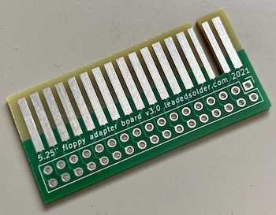

# Floppy Adapter v3
This adapter is intended to allow older computers equipped with 5.25" floppy drives using an edge connector to use a 3.5" floppy drive.

For long-term reliability, especially in humid environments or when the adapter is expected to be plugged and unplugged often, it's recommended that you pay extra at fabrication time to get hard gold fingers and a bevel. You can bevel it yourself with sandpaper, if needed.

This project was developed as part of a [leaded solder](https://www.leadedsolder.com/) repair of a Sharp X1turbo, and based on an older board developed for a conversion of a NEC PC-8801mkII.

# Gerber files
You can get the gerber files from [the releases page](https://github.com/barbeque/floppy-edge-connector-adapter/releases/). My usual fabs are JLCPCB, PCBWay and Osh Park.

# Bill of Materials
 * 34-pin female IDC right-angle header (0.100") such as [S9207-ND](https://www.digikey.ca/product-detail/en/sullins-connector-solutions/SFH11-PBPC-D17-RA-BK/S9207-ND/1990100) on DigiKey.

# Assembly instructions
 1. Solder the right-angle IDC connector to the board, such that the plastic part of the connector is on the side of the board reading "mount connector this side."
 2. Install adapter into your ribbon cable. If there is no key "tab" on your computer's connector, check for a red wire on the ribbon cable or a triangle marking on the ribbon cable connector in order to know which pin is "1."
 3. Attach drive to adapter, minding the tab on the right-angle IDC connector to get it the right way around.

# Tested on
 - NEC PC-8801mkII
 - NEC PC-8801mkIISR
 - Sharp X1turbo
