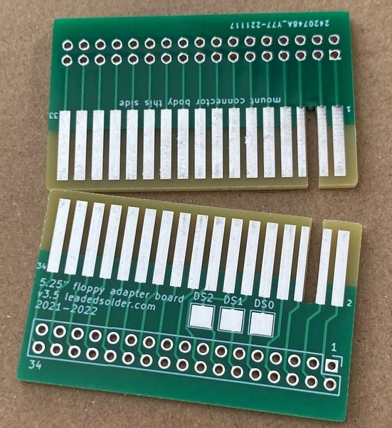

# Floppy Adapter v3
This adapter is intended to allow older computers equipped with 5.25" floppy drives using an edge connector to use a 3.5" floppy drive.

For long-term reliability, especially in humid environments or when the adapter is expected to be plugged and unplugged often, it's recommended that you pay extra at fabrication time to get hard gold fingers and a bevel. You can bevel it yourself with sandpaper, if needed.

This project was developed as part of a [leaded solder](https://www.leadedsolder.com/) repair of a Sharp X1turbo, and based on an older board developed for a conversion of a NEC PC-8801mkII.

# Version History
## v3.5 (2022)
Add "drive select" breakout pins on the top. This was done to enable a single HxC to emulate two drives on the NEC PC-8801. Thanks to Frio for requesting and co-operating with the development of this version of the adapter.

## v3.0 (2021)

Original release of this board, fixing mounting issues from previous releases.

# Gerber files
You can get the gerber files from [the releases page](https://github.com/barbeque/floppy-edge-connector-adapter/releases/). My usual fabs are JLCPCB, PCBWay and Osh Park.

You can also [order it directly from the project page on PCBWay](https://www.pcbway.com/project/shareproject/5_25__Floppy_edge_connector_to_34_pin_3_5__floppy_drive_adapter.html), which gives me some PCBWay credit that I can use on future custom board projects.

# Bill of Materials
 * 34-pin female IDC right-angle header (0.100") such as [S9207-ND](https://www.digikey.ca/product-detail/en/sullins-connector-solutions/SFH11-PBPC-D17-RA-BK/S9207-ND/1990100) on DigiKey.

# Assembly instructions
 1. Solder the right-angle IDC connector to the board, such that the plastic part of the connector is on the side of the board reading "mount connector this side."
 2. Install adapter into your ribbon cable. If there is no key "tab" on your computer's connector, check for a red wire on the ribbon cable or a triangle marking on the ribbon cable connector in order to know which pin is "1."
 3. Attach drive to adapter, minding the tab on the right-angle IDC connector to get it the right way around.

# HxC Dual Drive support on PC-8801
A single HxC floppy emulator can emulate two floppy drives at once. This usually "just works," but on the PC-8801 you must wire it a special way using two adapters.

 1. Solder one adapter fully with a right-angle connector as per the previous instructions.
 2. Solder a DuPont jumper wire onto the "Drive Select 0" (DS0) pad of the second adapter.
 3. Install one adapter into each floppy cable on the PC-8801.
 4. Connect the fully-populated adapter to the HxC, and run the jumper wire from the other into the "DS1" select line on the back of the HxC.

For more guidance, please consult [the HxC forum thread for running two drives on a PC-8801.](https://torlus.com/floppy/forum/viewtopic.php?t=502)

# Tested on
 - NEC PC-8801mkII
 - NEC PC-8801mkIISR
 - Sharp X1turbo
 - Sharp X1 Twin
